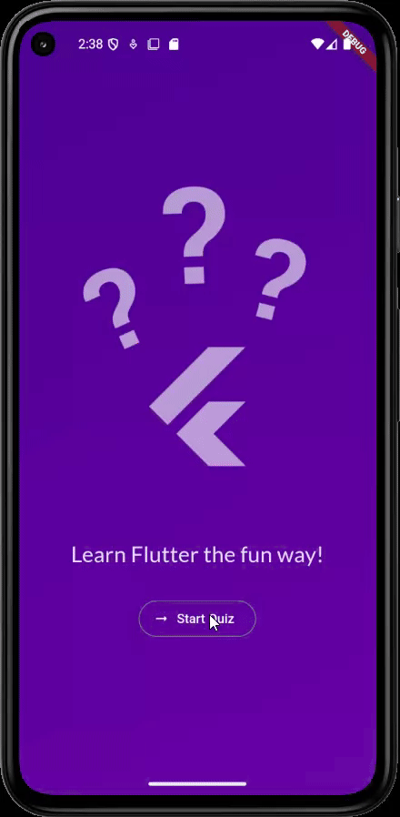

# Flutter Quiz App

## Overview
The Flutter Quiz App is a dynamic and interactive application built to demonstrate the power and flexibility of Flutter. This project showcases essential Flutter development practices, including state management, widget composition, and navigation. It is designed to provide a hands-on learning experience for developers of all levels, from beginners to seasoned professionals.

### Key Highlights:
- **State Management**: The app leverages Flutter's stateful and stateless widgets to manage the state of the quiz, ensuring a smooth and responsive user experience.
- **Widget Composition**: The app is built using a modular approach, with reusable and well-structured widgets that promote clean and maintainable code.
- **Navigation**: Implements Flutter's navigation system to seamlessly transition between screens, such as the quiz interface and the results screen.
- **Responsive Design**: The app is optimized for mobile devices, ensuring a consistent and visually appealing experience across different screen sizes.
- **Dart Language**: Written entirely in Dart, the app takes advantage of Dart's features like null safety and asynchronous programming to build a robust and efficient application.
- **Integration with Assets**: Includes custom assets like images and animations to enhance the user interface and make the app more engaging.

Whether you're exploring Flutter for the first time or looking to refine your skills, this project serves as a practical example of building a feature-rich application from the ground up.

## Table of Contents
- [Built With](#built-with)
- [Features](#features)
- [Prerequisites](#prerequisites)
- [How to Run](#how-to-run)
- [License](#license)


## Built With
| Technology       | Badge                                                                 |
|------------------|-----------------------------------------------------------------------|
| Flutter          |  |
| Dart             |  |
| Android Studio   |  |


## Features
- Interactive quiz interface.
- Multiple-choice questions.
- Score tracking.
- Responsive design for mobile devices.

## Preview
Here is a preview of the Flutter Quiz App in action:



## Prerequisites
- Flutter SDK installed. [Get Flutter](https://flutter.dev/docs/get-started/install)
- Dart SDK installed.
- A code editor like Visual Studio Code or Android Studio.

## How to Run
1. Clone the repository:
  ```bash
  git clone https://github.com/your-username/flutter-quiz-app.git
  ```
2. Navigate to the project directory:
  ```bash
  cd flutter-quiz-app
  ```
3. Get the dependencies:
  ```bash
  flutter pub get
  ```
4. Run the app:
  ```bash
  flutter run
  ```

## License
This project is licensed under the MIT License. See the [LICENSE](LICENSE) file for details.